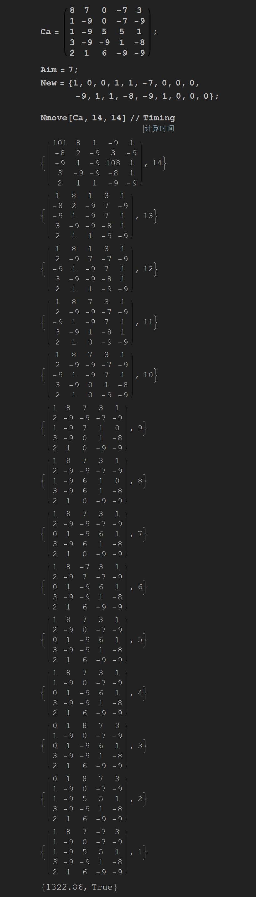
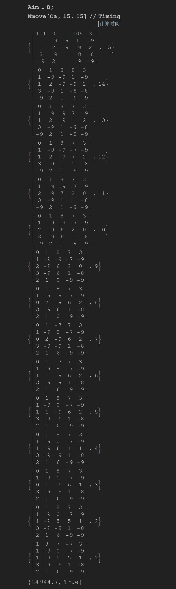

Mathematica Levels Solver
=====

Levels is a card sliding and merge game (like 2048) created by Shumpei Hayashi. (Levels is a terrible name for a game, you need to search for the author's name to find the game)

Levels 是由 Shumpei Hayashi 开发的一个像 2048 一样的卡片合成游戏。（这个名字起的不好，搜作者的名字才能搜到这个游戏…）


Manually I can only reach level 8. So I wrote a mathematica program to help me play this game. Introductions for each version are listed below:

萌狸君手动最高只能合成到 8 级，于是决定开起亲爱的 matica 来玩坏这个游戏。程序各版本介绍如下：

- `v0.1` : future cards unknown, use probability distribution and repeat each experiments for several times, use number-of-available-moves to determine the best move.

- `v0.1` : 未来的卡片序列未知，用概率分布生成，每一步要重复多次实验，最后用可移动数来判定局势优劣。

- `v0.2` : future card sequence is known (by the save&load trick), which saved the repeated experiment computation,  use number-of-available-moves to determine the best move.

- `v0.2` : 未来的卡片序列已知（存档读档大法），节约了重复实验的计算量，最后用可移动数来判定局势优劣。

- `v0.3` : future card sequence is known, search until high level blue card is born.

- `v0.3` : 未来的卡片序列已知，搜索到有高级蓝卡合成为止。

In the later period of the game playing, `v0.3` would be the most effective version. Therefore the introduction will be focus on this version.

游戏玩到后期，`v0.3` 是最有效的，所以以下只介绍这个版本。


# Preparation 准备工作

1. use third party app to save the game (e.g. TitaniumBackup)

2. do any move for about 15 steps, record new appear cards

3. load the backup, run mathematica, search for feasible synthesis route

1. 用第三方软件存档（例如钛备份）

2. 随便走个 15 步，记录新出现的卡片

3. 读档，开动 mathematica 搜索合成路线

- P.S. new cards prediction is only correct for 15 steps, after 15 steps the sequence might change, then you have to do another save&load

- 注：每次存档读档后 15 步内，新卡出现的序列是一样的，但超过 15 步之后预测就开始不准了，需要再次存档读档


# How to run 如何运行

`Ca` : set the initial status of the cards, red cards are denoted with negative integers, money zero (currently the program does not consider money merging)

设置初始局势，红卡记作负数，金钱都是零（目前的程序不考虑金钱的合并）

```
Ca = ( {
    {8, 7, 0, -7, 3},
    {1, -9, 0, -7, -9},
    {1, -9, 5, 5, 1},
    {3, -9, -9, 1, -8},
    {2, 1, 6, -9, -9}
   } );
```


`Aim` : the minimum card level you wish to merge (if you set `Aim=7`, the program will search until level 8 card is born)

设置搜索目标，如果设为 7 则搜索到 8 级卡合成出来为止

```
Aim = 7;
```

`New` is the new card sequence that you recorded by the save&load trick

设置从存档读档大法得到的新卡序列

```
New = {1, 0, 0, 1, 1, -7, 0, 0, 0, -9, 1, 1, -8, -9, 1, 0, 0, 0};
```

Run recursive function `Nmove` to start searching, 14 is the search depth, input it twice

开动这个递归函数，14 是搜索深度，需输入两个

```
Nmove[Ca, 14, 14] // Timing
```


# Practice example 实战范例

I played to this 8765 board manually:

我先手动玩到了这个 8765 档：


It took mathematica 1 hour on laptop CPU i5-6200U to find a nice route to level 5.

投喂了一个小时的 i5-6200U 后，麦酱找到了一个相当好的 5 级合成路线


Do another save&load

再做一次存档读档


After 20 minutes on i7-4790K, a route to level 8 is discovered, with which I can proceed to get level 9 manually.

转移到台式机 i7-4790K 上，二十分钟后找到一个 8 级路线（之后我可以手动合成到 9 级）



Since the computer is free for the night, let's try if it can find level 9 directly, and after 7 hours it did...

晚上闲着没事，直接搜 9 级试试，花 7 个小时后还真搜到了…



This save is named 9, you can download it on my GitHub page

这个存档名称为 9，在我的 GitHub 页面提供存档下载


# Links 链接

Mathematica 程序下载

| [v0.1](http://raw.githubusercontent.com/LePtC/MaticaGuokr/master/201607/LevelsSolver.v0.1.nb) | [v0.2](http://raw.githubusercontent.com/LePtC/MaticaGuokr/master/201607/LevelsSolver.v0.2.nb) | [v0.3](http://raw.githubusercontent.com/LePtC/MaticaGuokr/master/201607/LevelsSolver.v0.3.nb) |
|---|---|---|

TitaniumBackup 存档下载

| [8765](http://raw.githubusercontent.com/LePtC/MaticaGuokr/master/201607/app.flow.levels-8765.tar.gz) | [8766](http://raw.githubusercontent.com/LePtC/MaticaGuokr/master/201607/app.flow.levels-8766.tar.gz) | [9](http://raw.githubusercontent.com/LePtC/MaticaGuokr/master/201607/app.flow.levels-9.tar.gz) |
|---|---|---|

Video 实测视频

| [youtube](https://www.youtube.com/) | [bilibili](http://space.bilibili.com/2654670/) |
|---|---|


# TODO

- Cancel the +100 marker in the mathematica program to make the print out result more tidy.

- Compile a C version program so it would be convenient for people without Mathematica, probably runs faster too.

- Play to level 10...

Weather I will do the above tasks depend on how many people are interested in this project, so let me know if you are interested : )

- 减掉程序中的 +100 标记，使结果看起来更干净

- 编译一个 C 程序版本的让没有 Mathematica 的人也能用，可能跑的也更快

- 玩到第十级…

我是否会做以上的事项取决于有多少人感兴趣，所以如果你感兴趣请告知 ╮(╯_╰)╭
