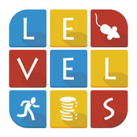
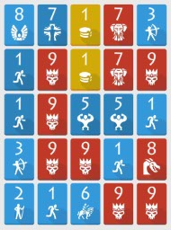

Mathematica Levels Solver
=====

Levels (by Shumpei Hayashi) is a card sliding and merge game (like 2048). (Levels is a terrible name for a game, you need to search for the author's name to find the game)

Levels (by Shumpei Hayashi) 是一个类似于 2048 的合成游戏。（这个名字起的不好，搜作者的名字才能搜到这个游戏…）



Same level blue cards can merge and level up. The game add neutual (money) and enemy cards. Money can be eliminated by blue cards, which actually serves as available moving spaces. Red cards can not be manipulated, can only be eliminated by equal or higher level blue cards.

相同的蓝色卡牌可以合成升级，此外增加了中立（金钱）和敌人（红色）卡牌。金钱可被蓝卡消除，实际上起到可移动空间的作用。红卡不可操作，只能被相同或更高级的蓝卡消除。



Like 2048, the game ends when there is no available moves.

和 2048 一样，游戏玩到无路可走结束。

Manually I can only reach level 8. So I wrote a mathematica program to help me play (crack) this game.

萌狸君手动最高只能合成到 8 级，于是决定开起亲爱的 matica 来玩坏这个游戏。


# Mathematica programs 程序版本说明

- `v0.1` : future cards unknown, use probability distribution and repeat each experiments for several times, use number-of-available-moves to determine the best move.

- `v0.2` : future card sequence is known (by the save&load trick), which saved the repeated experiment computation,  use number-of-available-moves to determine the best move.

- `v0.3` : future card sequence is known, search until high level blue card is born.

In the later period of the game playing, `v0.3` would be the most effective version. Therefore the introduction will be focus on this version.

- `v0.1` : 未来的卡片序列未知，用概率分布生成，每一步要重复多次实验，最后用可移动数来判定局势优劣。

- `v0.2` : 未来的卡片序列已知（存档读档大法），节约了重复实验的计算量，最后用可移动数来判定局势优劣。

- `v0.3` : 未来的卡片序列已知，搜索到有高级蓝卡合成为止。

游戏玩到后期，`v0.3` 是最有效的，所以以下只介绍这个版本。


# Preparation 准备工作

1. use third party app to save the game (e.g. TitaniumBackup)

2. do any move for about 15 steps, record new appear cards

3. load the backup, run mathematica, search for feasible synthesis route

- P.S. new cards prediction is only correct for 15 steps, after 15 steps the sequence might change, then you have to do another save&load

1. 用第三方软件存档（例如钛备份）

2. 随便走个 15 步，记录新出现的卡片

3. 读档，开动 mathematica 搜索合成路线

- 注：每次存档读档后 15 步内，新卡出现的序列是一样的，但超过 15 步之后预测就开始不准了，需要再次存档读档


# How to run 如何运行

`Ca` : set the initial status of the cards, red cards are denoted with negative integers, money zero (currently the program does not consider money merging)

设置初始局势，红卡记作负数，金钱都是零（目前的程序不考虑金钱的合并）


```
Ca = ( {
    {8, 7, 0, -7, 3},
    {1, -9, 0, -7,  -9},
    {1, -9, 5, 5, 1},
    {3, -9, -9, 1, -8},
    {2, 1, 6, -9, -9}
   } );
```

`Aim` : the minimum card level you wish to merge (if you set `Aim=7`, the program will search until level 8 card is born)

设置搜索目标，如果设为 7 则搜索到 8 级卡合成出来为止

```
Aim = 7;
```

`New` is the new card sequence that you recorded by the save&load trick

设置从存档读档大法得到的新卡序列

```
New = {1, 0, 0, 1, 1, -7, 0, 0, 0, -9, 1, 1, -8, -9, 1, 0, 0, 0};
```

Run recursive function `Nmove` to start searching, 14 is the search depth, input it twice

开动这个递归函数，14 是搜索深度，需输入两个

```
Nmove[Ca, 14, 14] // Timing
```


# Video example 实测视频

| [youtube](https://www.youtube.com/) | [bilibili](http://space.bilibili.com/2654670/) |
|---|---|


# Links 链接

Mathematica 程序下载

| [v0.1](https://github.com/LePtC/MaticaGuokr/raw/master/201607/LevelsSolver.v0.1.nb) | [v0.2](https://github.com/LePtC/MaticaGuokr/raw/master/201607/LevelsSolver.v0.2.nb) | [v0.3](https://github.com/LePtC/MaticaGuokr/raw/master/201607/LevelsSolver.v0.3.nb) |
|---|---|---|

TitaniumBackup 存档下载

| [8765](https://github.com/LePtC/MaticaGuokr/raw/master/201607/TitaniumBackup/app.flow.levels-8765.tar.gz) | [8766](https://github.com/LePtC/MaticaGuokr/raw/master/201607/TitaniumBackup/app.flow.levels-8766.tar.gz) | [88](https://github.com/LePtC/MaticaGuokr/raw/master/201607/TitaniumBackup/app.flow.levels-88.tar.gz) | [95](https://github.com/LePtC/MaticaGuokr/raw/master/201607/TitaniumBackup/app.flow.levels-95.tar.gz) |
|---|---|---|---|


# TODO

- Cancel the +100 marker in the mathematica program to make the print out result more tidy.

- Compile a C version program so it would be convenient for people without Mathematica, probably runs faster too.

- Play to level 10...

Weather I will do the above tasks depend on how many people are interested in this project, so let me know if you are interested : )

- 减掉程序中的 +100 标记，使结果看起来更干净

- 编译一个 C 程序版本的让没有 Mathematica 的人也能用，可能跑的也更快

- 玩到第十级…

我是否会做以上的事项取决于有多少人感兴趣，所以如果你感兴趣请告知 ╮(╯_╰)╭
